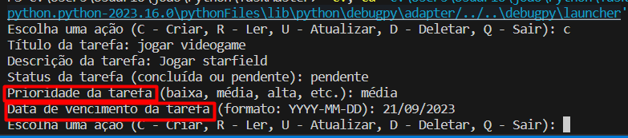

# TaskMaster - Aplicativo de Lista de Tarefas
 
O TaskMaster é um simples aplicativo de lista de tarefas desenvolvido em Python, seguindo o padrão de arquitetura Model-View-Controller (MVC). Ele permite que os usuários criem, visualizem, atualizem e excluam tarefas em uma lista de afazeres, com recursos adicionais de prioridade e data de vencimento.

## Funcionalidades Principais

* Criar Tarefas: Os usuários podem criar novas tarefas especificando o título, descrição, status (concluída ou pendente), prioridade (baixa, média, alta, etc.) e data de vencimento (opcional).

* Listar Tarefas: O aplicativo exibe uma lista de todas as tarefas, incluindo detalhes como título, status, prioridade e data de vencimento no formato brasileiro (dd/mm/aaaa).

* Atualizar Tarefas: Os usuários podem editar tarefas existentes, incluindo a modificação de título, descrição, status, prioridade e data de vencimento.

* Excluir Tarefas: Tarefas indesejadas podem ser excluídas da lista.

# Como Usar

1. Clone este repositório para o seu ambiente local.

git clone https://github.com/seu-usuario/taskmaster.git

2. Navegue até a pasta do projeto.
cd taskmaster

3. Execute o aplicativo Python.
python src/main.py

4. Use as opções a seguir para interagir com o aplicativo:
* - C - Criar uma nova tarefa.
* - R - Listar todas as tarefas.
* - U - Atualizar uma tarefa existente.
* - D - Excluir uma tarefa.
* - Q - Sair do aplicativo.
Lembre-se de que as datas de vencimento devem ser inseridas no formato brasileiro (dd/mm/aaaa).

## Contribuições
Contribuições são bem-vindas! Sinta-se à vontade para melhorar e expandir este aplicativo de lista de tarefas. Abra um problema ou envie uma solicitação de pull request para colaborar.

Esperamos que o TaskMaster ajude você a gerenciar suas tarefas de forma eficaz e organizada!